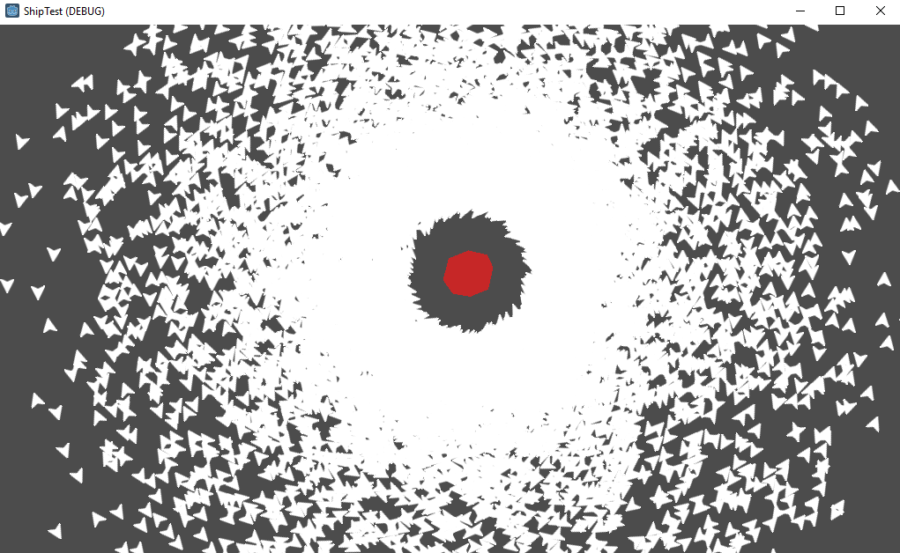

# ShipTest
Performance test: Calculation and rendering of ~~10.000~~[1] 250.000 ships orbiting a planet at 60 FPS using the Godot Engine.

[1] 10.000 was more or less the upper limit using a loop in the process function and direct calls to the VisualServer. After switching to a custom particle shader, this limit was drastically increased to more than 250.000 on a run-of-the-mill office laptop without any fancy GPU.

